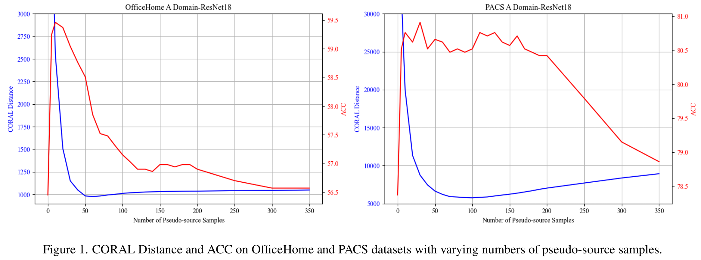
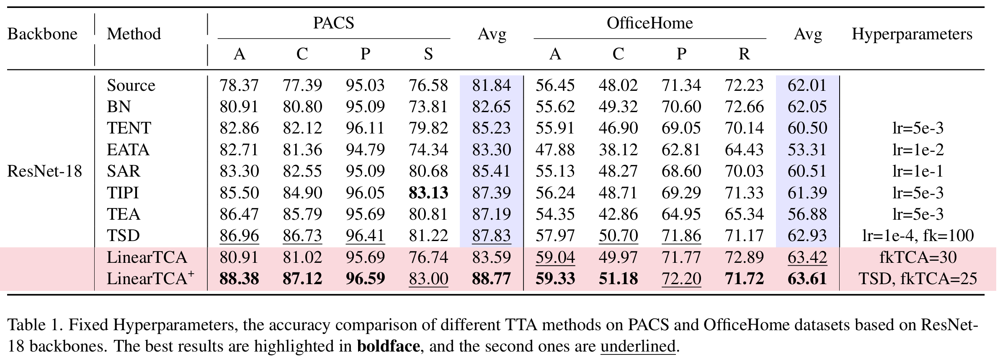
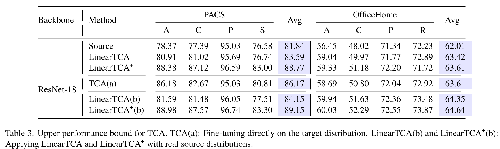
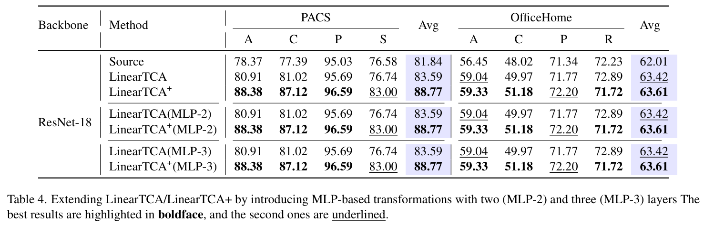
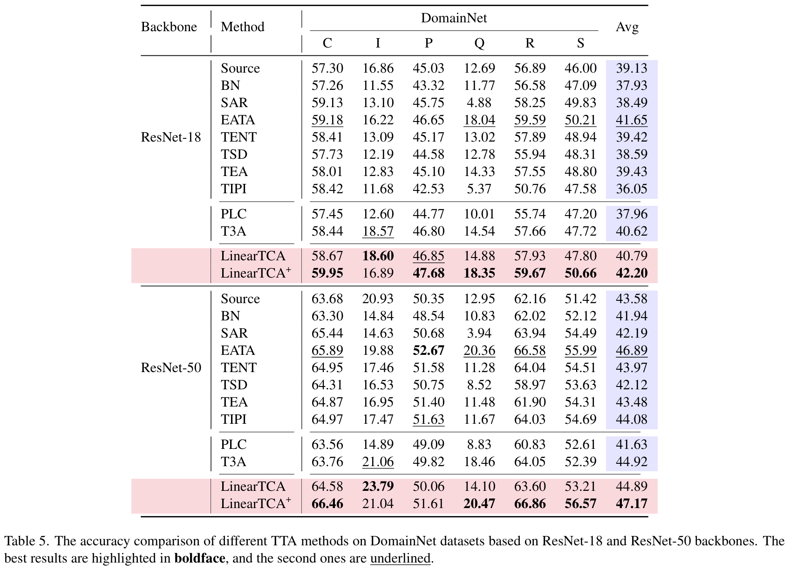
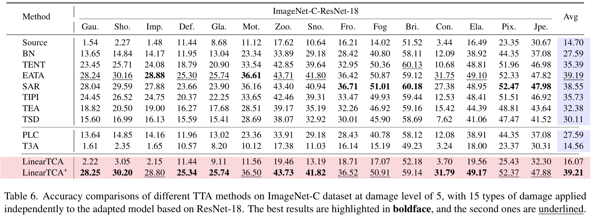
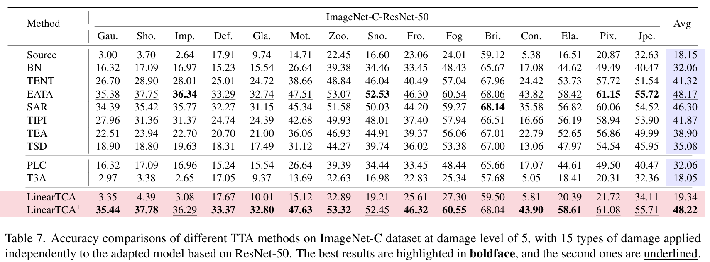
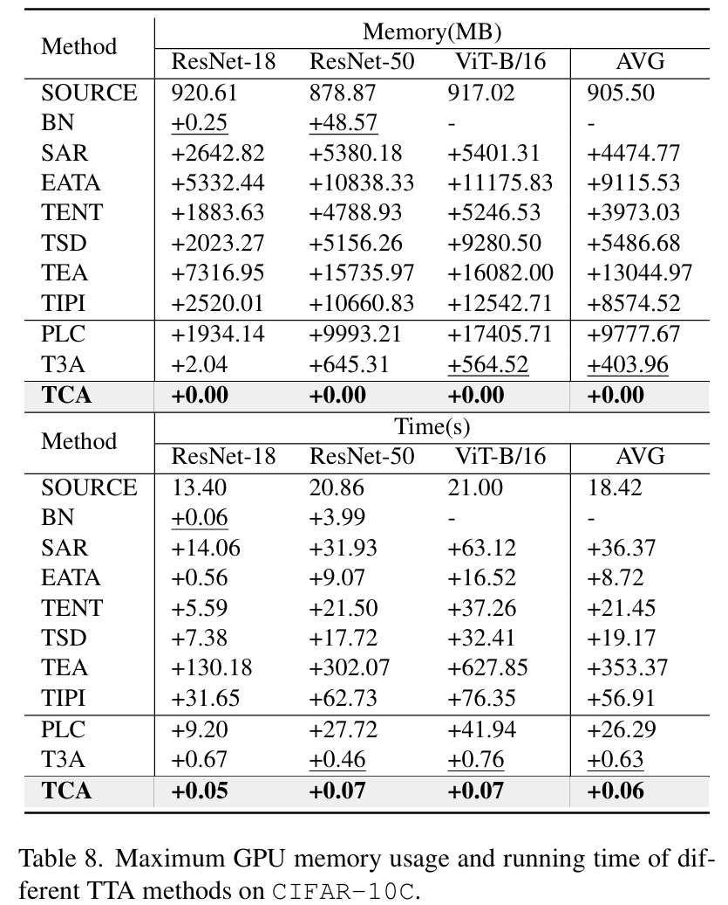
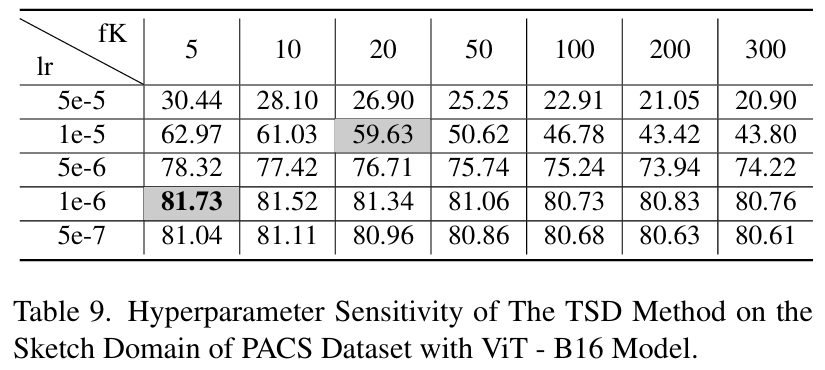
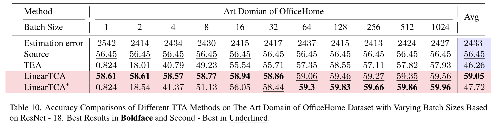

# TCA: Test-time Correlation Alignment
- **Figure 1**:
- **Table 1**: 
- **Table 2**: 
- **Table 3**: 
- **Table 4**: 
- **Table 5**: 
- **Table 6**: 
- **Table 7**: 
- **Table 8**: 
- **Table 9**: 
- **Table 10**: 
